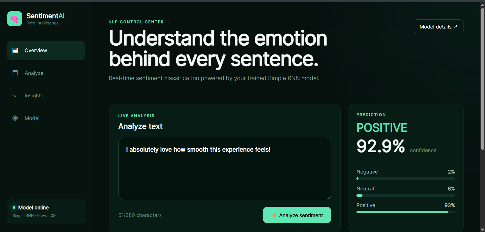
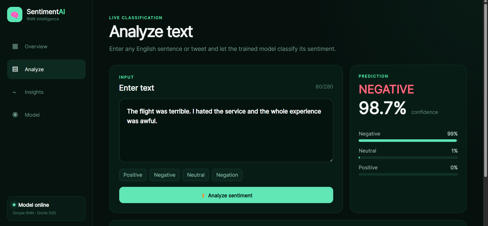
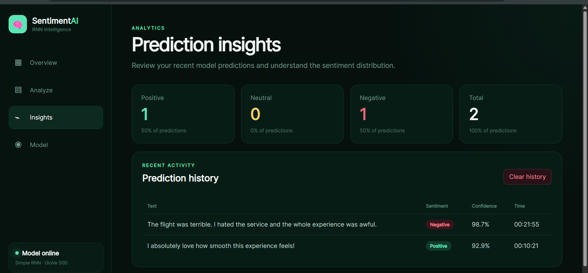
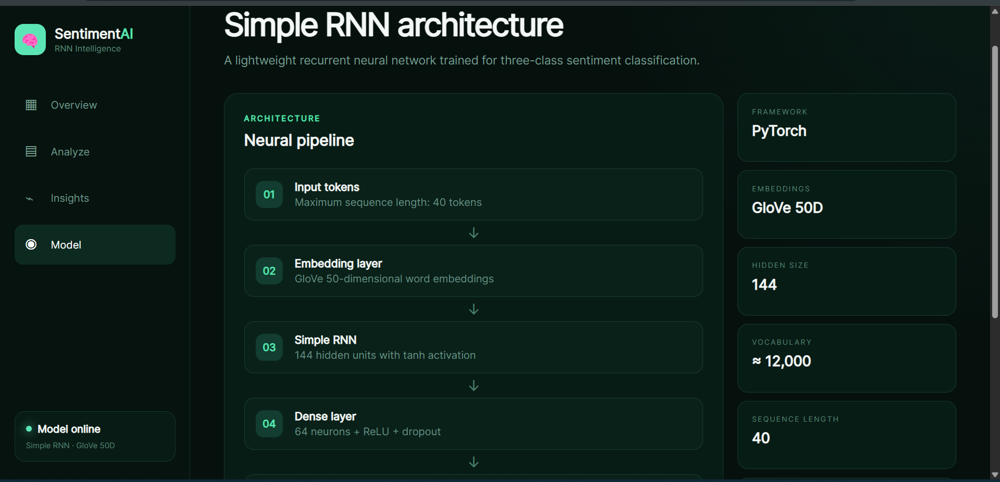

# 🧠 SentimentAI

### From Scratch RNN Sentiment Analysis — Training, API, and Web Application

SentimentAI is an end-to-end Natural Language Processing project built **from scratch**, starting from raw text data and model training, all the way to a working full-stack web application.

The project does not rely on a ready-made sentiment API or a pre-trained classification service.

The complete pipeline was implemented manually:

- Data preprocessing
- Text cleaning
- Tokenization
- Stopword filtering
- Lemmatization
- Vocabulary construction
- GloVe embedding integration
- Simple RNN implementation
- PyTorch training
- Model evaluation
- Artifact export
- FastAPI inference backend
- React + Vite frontend
- Prediction history and analytics

---

## 🚀 Project Overview

SentimentAI classifies English text into three sentiment categories:

- **Positive**
- **Neutral**
- **Negative**

The system uses a custom-trained **Simple Recurrent Neural Network (RNN)** built with PyTorch and powered by **GloVe word embeddings**.

The trained model is deployed through a FastAPI backend and connected to a modern React + Vite interface for real-time sentiment prediction.

---

## ✨ Application Preview

### Overview



### Analyze



### Insights



### Model Architecture



---

## 🧩 Built From Scratch

This project was developed as a complete machine learning workflow rather than only a notebook or frontend demo.

### Full Pipeline

1. Raw dataset loading
2. Missing-value handling
3. Duplicate removal
4. Text preprocessing
5. Text cleaning
6. Tokenization
7. Stopword filtering
8. Lemmatization
9. Class balancing
10. Vocabulary construction
11. Out-of-vocabulary handling
12. Sequence padding and truncation
13. GloVe embedding integration
14. Simple RNN architecture implementation
15. PyTorch training loop
16. Validation
17. Early stopping
18. Model evaluation
19. Model artifact export
20. Real-time inference pipeline
21. FastAPI REST API
22. React + Vite frontend
23. Prediction history
24. Sentiment analytics
25. Model information dashboard

---

## 🎯 Main Features

- Real-time sentiment classification
- Positive, Neutral, and Negative predictions
- Confidence scores for all three classes
- Custom-trained PyTorch Simple RNN
- GloVe 50-dimensional embeddings
- Consistent preprocessing between training and deployment
- FastAPI REST backend
- React + Vite frontend
- Prediction history
- Sentiment statistics
- Model architecture page
- Responsive interface
- Browser-based local persistence
- Backend health endpoint
- Interactive FastAPI documentation

---

## 🧠 Model Architecture

The sentiment prediction pipeline follows:

```text
Raw Text
   ↓
Text Cleaning
   ↓
Tokenization
   ↓
Stopword Filtering
   ↓
Lemmatization
   ↓
Vocabulary Encoding
   ↓
Sequence Padding
   ↓
GloVe 50D Embeddings
   ↓
Simple RNN
144 Hidden Units
   ↓
Dense Layer
64 Units
   ↓
ReLU
   ↓
Dropout
   ↓
Output Layer
3 Classes
   ↓
Negative | Neutral | Positive
```

---

## ⚙️ Model Configuration

| Component | Configuration |
|---|---|
| Framework | PyTorch |
| Architecture | Simple RNN |
| Embeddings | GloVe 50D |
| Hidden Size | 144 |
| Dense Layer | 64 |
| Sequence Length | 40 |
| Vocabulary Size | ~12,000 |
| Output Classes | 3 |
| Classes | Negative, Neutral, Positive |

---

## 🧪 Example Predictions

### Positive

```text
I absolutely loved this flight. The service was amazing and everything was perfect.
```

Example prediction:

```text
Positive — ~99%
```

### Negative

```text
The flight was terrible. I hated the service and the whole experience was awful.
```

Example prediction:

```text
Negative — ~98%
```

### Neutral

```text
The flight departed at 8 PM and arrived at the airport two hours later.
```

Example prediction:

```text
Neutral — ~97%
```

---

## 🏗️ Technology Stack

### Machine Learning

- Python
- PyTorch
- NLTK
- Pandas
- NumPy
- GloVe Word Embeddings

### Backend

- FastAPI
- Uvicorn
- Pydantic
- PyTorch inference

### Frontend

- React
- Vite
- JavaScript
- CSS

---

## 📂 Project Structure

```text
sentimentai/
│
├── backend/
│   ├── artifacts/
│   │   ├── best_simple_rnn.pt
│   │   ├── config.json
│   │   └── word2idx.json
│   │
│   ├── inference.py
│   ├── main.py
│   ├── export_artifacts.py
│   └── requirements.txt
│
├── frontend/
│   ├── src/
│   │   ├── main.jsx
│   │   └── styles.css
│   │
│   ├── index.html
│   ├── package.json
│   └── package-lock.json
│
├── docs/
│   └── screenshots/
│       ├── overview.png
│       ├── analyze.png
│       ├── insights.png
│       └── model.png
│
├── .gitignore
└── README.md
```

---

## 🔌 API Endpoints

### Health Check

```http
GET /health
```

Example response:

```json
{
  "status": "ok",
  "model_ready": true,
  "mode": "trained"
}
```

---

### Model Information

```http
GET /model-info
```

---

### Sentiment Prediction

```http
POST /predict
```

Request:

```json
{
  "text": "The service was amazing."
}
```

Example response:

```json
{
  "text": "The service was amazing.",
  "sentiment": "positive",
  "confidence": 98.7,
  "scores": {
    "negative": 0.004,
    "neutral": 0.009,
    "positive": 0.987
  },
  "model_mode": "trained"
}
```

---

## ▶️ Run Locally

### 1. Clone the repository

```bash
git clone https://github.com/YOUR_USERNAME/SentimentAI-RNN.git
cd SentimentAI-RNN
```

---

## Backend Setup

Navigate to the backend folder:

```bash
cd backend
```

Create a virtual environment:

```bash
python -m venv venv
```

Activate it on Windows:

```bash
venv\Scripts\activate
```

Install dependencies:

```bash
pip install -r requirements.txt
```

Run FastAPI:

```bash
uvicorn main:app --reload
```

Backend URL:

```text
http://127.0.0.1:8000
```

Health endpoint:

```text
http://127.0.0.1:8000/health
```

Interactive API documentation:

```text
http://127.0.0.1:8000/docs
```

---

## Frontend Setup

Open another terminal and navigate to the frontend:

```bash
cd frontend
```

Install dependencies:

```bash
npm install
```

Start the Vite development server:

```bash
npm run dev
```

Frontend URL:

```text
http://localhost:5173
```

---

## 🖥️ Application Pages

### Overview

The main dashboard provides a quick sentiment analysis interface together with model information and system status.

### Analyze

The Analyze page provides:

- Custom text input
- Positive example
- Negative example
- Neutral example
- Negation example
- Confidence score
- Class probabilities
- Model response information

### Insights

The Insights page stores recent predictions in the browser and displays:

- Total predictions
- Positive count
- Neutral count
- Negative count
- Sentiment distribution
- Recent prediction history

### Model

The Model page explains:

- Input sequence processing
- GloVe embeddings
- Simple RNN architecture
- Hidden size
- Dense layer
- Output classes
- Model limitations

---

## ⚠️ Model Limitations

This version intentionally uses a **Simple RNN** architecture.

Simple RNNs can perform well on straightforward sentiment patterns but may struggle with:

- Complex negation
- Long-range context
- Sarcasm
- Ambiguous language
- Complex sentence structure

For example:

```text
The service was not good and I would not recommend this airline.
```

may be more challenging than a direct positive or negative sentence.

This limitation is related to the model architecture, not the web application.

---

## 🔮 Future Improvements

Possible future improvements include:

- LSTM architecture
- GRU architecture
- Bidirectional RNN
- Transformer benchmark
- BERT-based sentiment classifier
- CSV batch sentiment analysis
- Database-backed history
- Exportable reports
- Authentication
- Cloud deployment
- Multi-language sentiment analysis

---

## 🎯 Project Goal

The main goal of SentimentAI is to demonstrate a complete machine learning product lifecycle:

```text
Raw Data
→ Preprocessing
→ Training
→ Evaluation
→ Model Export
→ API
→ Frontend
→ Real-Time Inference
```

Instead of stopping at a notebook, the trained machine learning model was transformed into a complete full-stack application.

---

## 📚 Training Workflow

The original training workflow includes:

- Dataset preparation
- Text preprocessing
- Class balancing
- Vocabulary construction
- GloVe embedding preparation
- RNN model definition
- Training loop
- Validation
- Early stopping
- Test evaluation
- Model artifact export

The exported artifacts are then loaded by the backend for real-time inference.

---

## 🔐 Model Artifacts

The deployed application uses:

```text
backend/artifacts/
├── best_simple_rnn.pt
├── config.json
└── word2idx.json
```

These files allow the FastAPI backend to recreate the trained model and use the exact vocabulary created during training.

---

## 🌐 Full-Stack Architecture

```text
User
  ↓
React + Vite Frontend
  ↓
POST /predict
  ↓
FastAPI Backend
  ↓
Text Preprocessing
  ↓
Vocabulary Encoding
  ↓
PyTorch Simple RNN
  ↓
Softmax Probabilities
  ↓
Positive / Neutral / Negative
  ↓
React Dashboard
```

---

## 📄 License

This project is available under the MIT License.

---

## ⭐ About SentimentAI

SentimentAI demonstrates how a machine learning experiment can be transformed into a complete usable product.

The project was built from scratch as an end-to-end NLP workflow using:

**PyTorch · Simple RNN · GloVe · FastAPI · React · Vite**

If you find the project useful, consider giving the repository a ⭐.